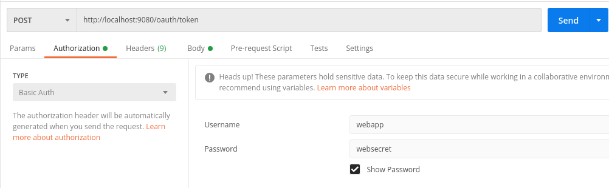
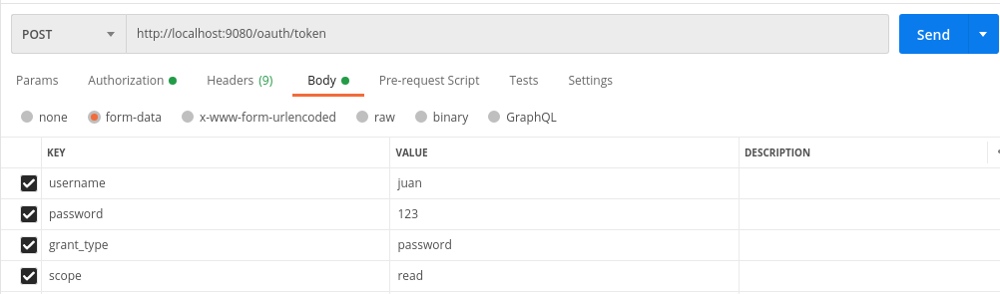
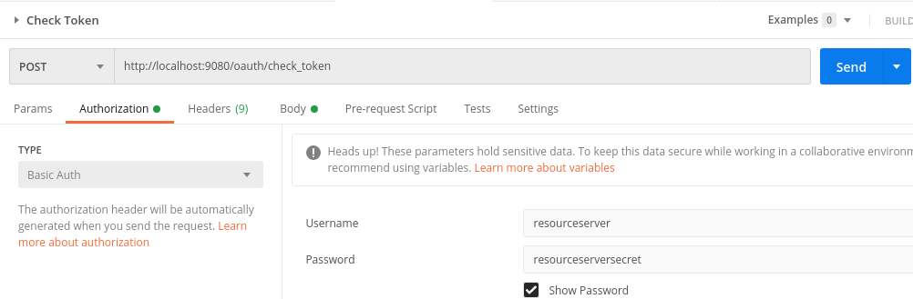
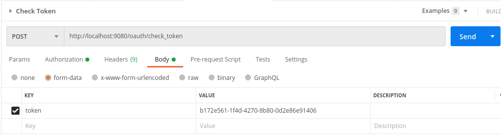
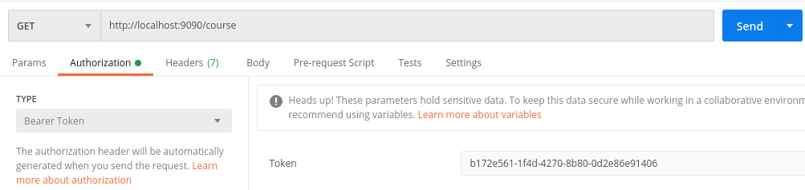
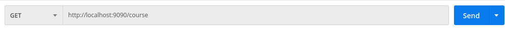
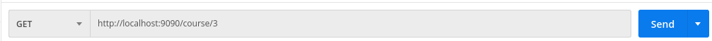
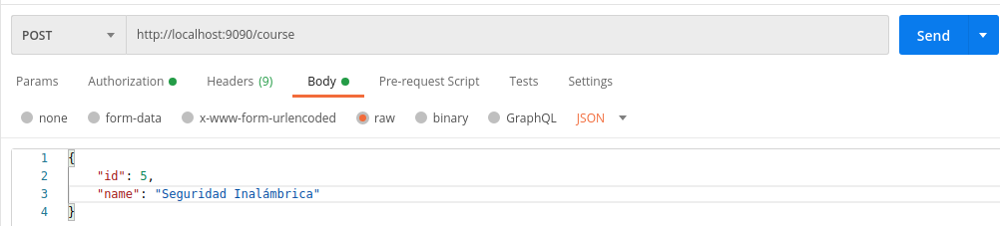
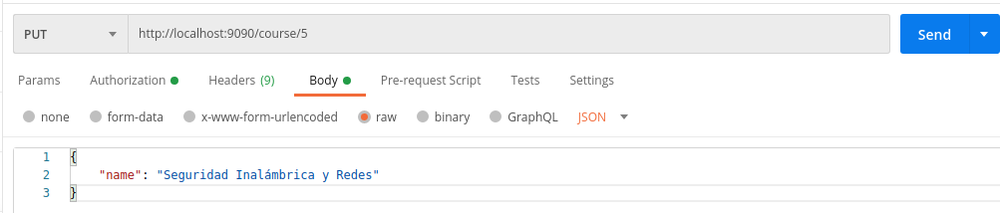
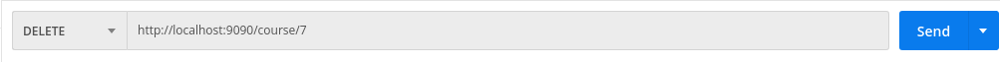

# Course-API-Postman
Colección para pruebas de [Authorization Server](https://github.com/fhbustos/authorization-server) y [Resource Server](https://github.com/fhbustos/resource-server).


Esta colección se encuentra para descargar en la carpeta **postman**.


## Obtener Token

Previo a las peticiones que se realizaran a la API Course se debe generar un token de acceso. Para ello se debe realizar un request al authorization-server a la URL http://localhost:9080/oauth/token indicando los datos del cliente y del usuario.

Los datos del cliente se envían como Basic Auth indicando en username el clientId y en password el clientSecret.




Los datos del usuario se envían como form-data especificando username, password, grant_type y scope.




Al enviar el request POST obtenemos un response en formato JSON como el siguiente:

```json
{
    "access_token": "b172e561-1f4d-4270-8b80-0d2e86e91406",
    "token_type": "bearer",
    "refresh_token": "8a2c6b8a-3ce3-4a44-a810-7668403ea9d3",
    "expires_in": 35999,
    "scope": "read"
}
```

Con el access-token obtenido se puede proceder a realizar los request de consulta a la API Course.


### Verificar Token

Se puede emular la verificación del token que realizará el resource-server. Esto se realiza enviando un request a la URL http://localhost:9080/oauth/check_token. En este caso se envía como Basic Auth el clientId y clientSecret del resource-server.




Y en form-data enviamos en el campo token el access token generado previamente.




Obtendremos un response JSON con la siguiente información:

```json
{
    "active": true,
    "exp": 1639399533,
    "user_name": "juan",
    "authorities": [
        "write"
    ],
    "client_id": "webapp",
    "scope": [
        "read"
    ]
}
```


## API Course

Teniendo el access token se pueden realizar distintas consultas a la API Course. En cada uno de los request se debe enviar el token como Bearer Token:




### Listar cursos

Los cursos se obtienen al realizar la operación GET sobre el recurso course:



Y el response devuele el listado de cursos en formato JSON:

```json
[
    {
        "id": 1,
        "name": "Hardening de Web Services"
    },
    {
        "id": 2,
        "name": "OWASP Top Ten"
    },
    {
        "id": 3,
        "name": "Seguridad Mobile"
    },
    {
        "id": 4,
        "name": "Seguridad Base de Datos"
    }
]
```


### Obtener información de un curso

Para obtener la información de un curso específico se debe agregar el id del curso a la URL:



y como resultado se obtiene:

```json
{
    "id": 3,
    "name": "Seguridad Mobile"
}
```


### Agregar un curso

Para agregar un nuevo curso se debe realizar un request POST enviando los datos del nuevo curso en formato JSON:


Si la inserción es correcta se obtiene un response con Status 200-OK y en el body vendrá el mismo JSON ingresado.


### Actualizar un curso

Para actualizar un curso se debe realizar un request PUT indicando el id del curso en la URL y agregando el JSON con los datos a modificar:


Si la actualización es correcta se obtiene un response con Status 200-OK y en el body se mostrará en formato JSON los datos del curso ya modificados.

En el caso que se especifique un Id no existente se agregará el curso como si fuera uno nuevo.


### Borrar un curso

Para borrar un curso se debe realizar un request DELETE y en la URL se debe especificar el id del mismo:


Si el borrado es correcto se obtiene un response con Status 200-OK sin body.
